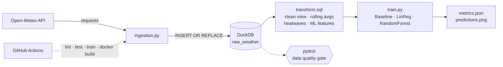
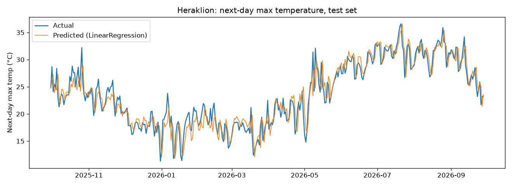

# Heraklion Weather Pipeline

[](https://github.com/balatheoni/heraklion-weather-pipeline/actions/workflows/ci.yml)


**An end-to-end data engineering pipeline in miniature:** live API → idempotent load → SQL transformations → data quality gates → ML forecast → CI/CD.
Built around 5 years of daily weather data for Heraklion, Crete.



## Results

Predicting **next-day maximum temperature**, evaluated on a chronological hold-out set (last 20% of days).

| Model | MAE (°C) | RMSE (°C) |
|---|---|---|
| Baseline (tomorrow = today) | 1.563 | 2.107 |
| Linear Regression | 1.502 | 1.997 |
| **Random Forest** | **1.502** | **1.980** |



**Takeaway:** both models beat the naive persistence baseline (~4% lower MAE, ~6% lower RMSE). The margin is small, and that is expected: next-day temperature is dominated by persistence, so further gains would need external forecast inputs (e.g. NWP model data) rather than more history-only features.

## 🧱 What's inside

| Layer | Implementation |
|---|---|
| **Extract** | Open-Meteo archive API, no key required |
| **Load** | DuckDB with a primary key and `INSERT OR REPLACE` → **idempotent**, safe to re-run |
| **Transform** | SQL views: CTEs, window functions (`LAG`, `LEAD`, rolling `AVG`), gaps-and-islands |
| **Quality** | 5 pytest checks: duplicates, nulls, plausible ranges, `min ≤ max`, non-empty |
| **ML** | Lag + rolling + seasonal features, **time-based split (no leakage)**, baseline comparison |
| **CI/CD** | GitHub Actions: ruff lint → full pipeline → artifacts upload → Docker build, plus a **weekly scheduled run** |
| **Packaging** | Dockerfile, Makefile |

## 🔍 SQL highlight: heatwave detection (gaps-and-islands)

```sql
WITH hot AS (
    SELECT date, temp_max,
           date - CAST(ROW_NUMBER() OVER (ORDER BY date) AS INTEGER) AS grp
    FROM clean_weather
    WHERE temp_max >= 35
)
SELECT MIN(date) AS start_date, MAX(date) AS end_date,
       COUNT(*) AS days, MAX(temp_max) AS peak_temp
FROM hot
GROUP BY grp
HAVING COUNT(*) >= 3;
```

Consecutive hot days share the same `date - row_number` value, so grouping on it finds each streak in a single pass.

## 🚀 Quickstart

**Local**
```bash
pip install -r requirements.txt
python ingestion.py   # download + load + build SQL views
pytest -q             # data quality gate
python train.py       # train & evaluate models
```

**Docker**
```bash
docker build -t heraklion-weather .
docker run --rm -v "$(pwd)":/app heraklion-weather
```

Explore the views yourself:
```bash
python -c "import duckdb; print(duckdb.connect('weather.duckdb').sql('SELECT * FROM heatwaves').df())"
```

## 🗂️ Structure

```
├── ingestion.py          # extract + idempotent load + run SQL
├── transform.sql         # views: clean, rolling, monthly climate, heatwaves, ML features
├── train.py              # model training & evaluation
├── test_quality.py       # data quality tests
├── Dockerfile
├── Makefile
├── ruff.toml
└── .github/workflows/ci.yml
```

## 🛣️ Roadmap

- [ ] Orchestrate with Apache Airflow
- [ ] Rebuild transformations in dbt with schema tests
- [ ] Add more Greek cities and a regional comparison
